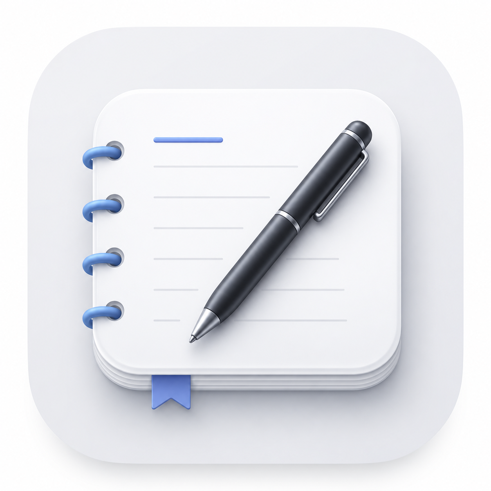

<div align="center">
  

  <h1>NoteFlow</h1>

  <p><strong>A native macOS notes app you can summon from anywhere.</strong></p>

  <p>
    
    
    
    
    
  </p>
</div>

---

NoteFlow is a fast, native macOS note-taking app built on SwiftUI + AppKit. It runs as a regular window when you need it, and as a global-hotkey overlay when you don't — so a thought never has to wait for an app to launch.

## Highlights

- **Summon from anywhere.** A single keystroke (`⌥D` by default, with a fixed `⌃⇧D` fallback) drops a floating editor on top of any app, on any Space, even over full-screen apps. No Space switch, no focus theft.
- **Same note, two windows, live.** Type in the floating panel and watch the main window update in real time — and vice versa. One shared `NSTextStorage` per note powers both editors.
- **Real rich text.** Bold, italic, underline, headings, bullets, checklists, and numbered lists with auto-continuation on `Enter`. Standard `⌘B` / `⌘I` / `⌘U` shortcuts (and their shifted variants).
- **Smart link handling.** Paste a URL — NoteFlow fetches the page's `og:title` in the background and quietly replaces the long URL with a clean inline label. `<title>` is used as a fallback.
- **Tabs + instant search.** Multi-tab workflow with a fast incremental search across titles and bodies, backed by a plain-text cache so search stays snappy on long notes.
- **No Accessibility permission needed.** The global hotkey uses Carbon `RegisterEventHotKey`, not the keyboard-event monitor route. Install and go.
- **Configurable hotkey.** Change the shortcut in Settings; the change is picked up live via `NotificationCenter`.
- **Persistent.** Notes are saved as JSON at `~/Library/Application Support/NoteFlow/notes.json`. Bodies are stored as RTF data.
- **Zero external dependencies.** Pure Apple frameworks: SwiftUI, AppKit, Foundation, Carbon.

## Install

### From DMG

1. Download `NoteFlow.dmg` from the latest [release](https://github.com/Ankitkumar7217734/NoteFlow/releases).
2. Open it and drag **NoteFlow.app** into **Applications**.
3. Launch.

> Gatekeeper note: this is an unsigned developer build. On first launch, **right-click the app → Open** to bypass the "developer cannot be verified" prompt.

### From source

```bash
git clone https://github.com/Ankitkumar7217734/NoteFlow.git
cd NoteFlow
swift run NoteFlow
```

Requires macOS 14+ and the Swift 5.9 toolchain (ships with Xcode 15+).

## Build a release DMG

```bash
bash scripts/make-dmg.sh
```

The script will:

1. Build the release binary (`swift build -c release`).
2. Assemble a `.app` bundle, generating `AppIcon.icns` from `Sources/NoteFlow/Resources/logo.png` via `sips` + `iconutil`.
3. Write a proper `Info.plist`.
4. Render the DMG background using `scripts/make-background.swift`.
5. Stage the bundle with an `Applications` symlink and style the volume window with AppleScript.
6. Compress everything to a UDZO-format DMG at the repo root.

## Keyboard shortcuts

| Action            | Shortcut                  |
|-------------------|---------------------------|
| Summon floating editor | `⌥D` (default) or `⌃⇧D` (fixed fallback) |
| Bold              | `⌘B` / `⌘⇧B`              |
| Italic            | `⌘I` / `⌘⇧I`              |
| Underline         | `⌘U` / `⌘⇧U`              |
| New note          | via the sidebar "New" icon |
| Close floating panel | The close button in the tab bar (or the hotkey again) |

## Architecture at a glance

```
┌─ AppDelegate ─────────────────────────────────────────────┐
│                                                           │
│   ┌─ NSWindow (main) ──────┐   ┌─ FloatingPanel ─────────┐│
│   │  ContentView           │   │  ContentView            ││
│   │   + WindowState        │   │   + WindowState         ││
│   └────────────┬───────────┘   └────────────┬────────────┘│
│                │                            │             │
│                └─────────┬──────────────────┘             │
│                          ▼                                │
│              NoteStore.shared (singleton)                 │
│                - notes, tabs, persistence                 │
│                - sharedTextStorage(for: noteId)           │
└───────────────────────────────────────────────────────────┘
```

**Two windows, one truth.** `NoteStore.shared` owns the data; each window owns its own `WindowState` (sidebar, search, formatting-toolbar visibility). The two editors share an `NSTextStorage` per note so a keystroke in one renders instantly in the other.

**The floating panel.** `FloatingPanel: NSPanel` overrides `canBecomeKey` / `canBecomeMain` so it remains typeable despite the `.nonactivatingPanel` style. That non-activating style is exactly what lets the panel appear on another Space's full-screen app without yanking the user back to NoteFlow's main-window Space.

For a deeper dive (Carbon hotkey registration, RTF persistence, link-title fetching, layout-sync hooks), see [CLAUDE.md](CLAUDE.md).

## Tech stack

| Layer              | Used                                                        |
|--------------------|-------------------------------------------------------------|
| UI                 | SwiftUI for layout, AppKit (`NSTextView`, `NSPanel`) for the editor and windowing |
| Global hotkey      | Carbon `RegisterEventHotKey` (no Accessibility permission)  |
| Persistence        | `JSONEncoder` + RTF `Data` in `Application Support/`        |
| Cross-window sync  | Shared `NSTextStorage` per note                             |
| Link enrichment    | `async` `URLSession` + `NSDataDetector` + `NSRegularExpression` |
| Packaging          | SwiftPM executable, `hdiutil` / `iconutil` / `sips` scripts |

## Project layout

```
Sources/NoteFlow/
├── AppDelegate.swift           Windows, floating panel, hotkey registration
├── NoteFlowApp.swift           @main entry, hands off to AppDelegate
├── Models/
│   ├── NoteStore.swift         Singleton data store + shared text storage
│   ├── Note.swift              Codable note model (RTF body)
│   ├── WindowState.swift       Per-window UI state
│   ├── HotkeyStore.swift       Persisted global hotkey config
│   ├── LinkTitleFetcher.swift  Background og:title scraper
│   └── AppLogo.swift           In-process Dock-icon generator
└── Views/
    ├── ContentView.swift
    ├── TabBarView.swift
    ├── SidebarIconBar.swift    Unified rail + notes list + search
    ├── RichTextEditor.swift    NSTextView wrapper + NoteTextView subclass
    ├── FormattingToolbarView.swift
    └── SettingsView.swift      Hotkey recorder
```

## Roadmap

- iCloud sync via CloudKit
- Markdown import / export
- Tags and smart folders
- Bidirectional `[[wiki-style]]` links
- Quick-paste templates and snippets
- Code-block syntax highlighting

## Contributing

This started as a personal project — pull requests are welcome, but please open an issue first to discuss anything non-trivial. The codebase is small and intentionally framework-only; new dependencies will be considered very carefully.

## License

Not yet specified — all rights reserved for now.
